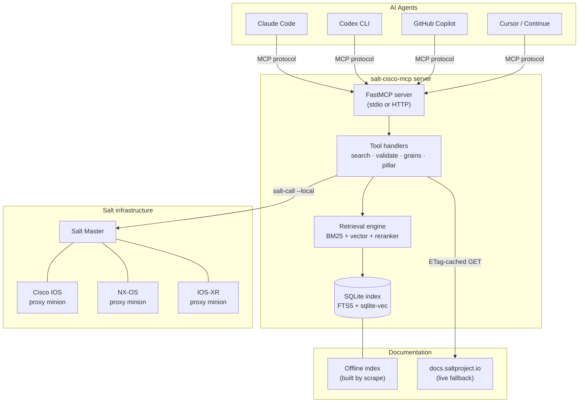
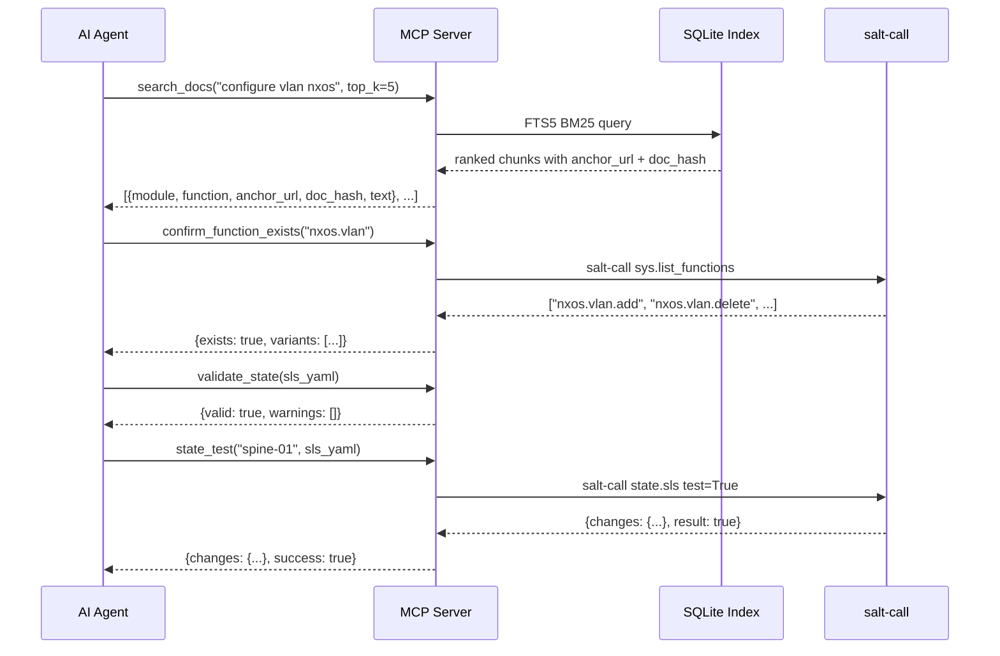
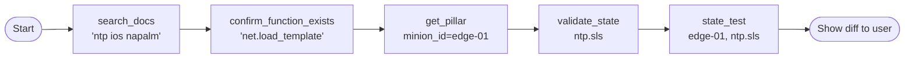
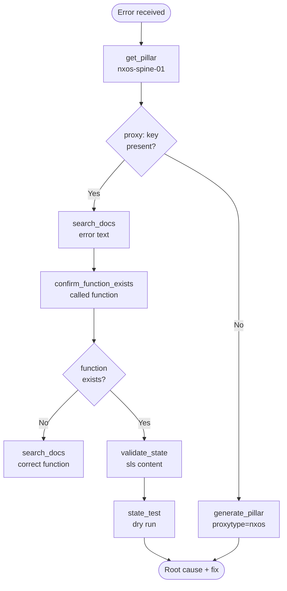
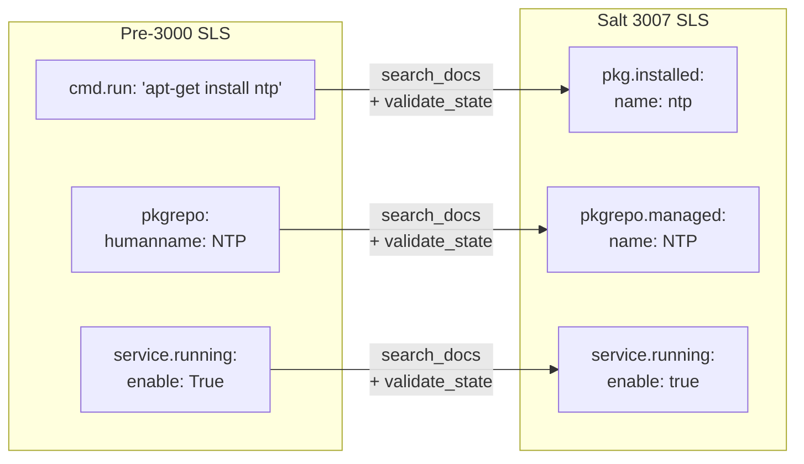
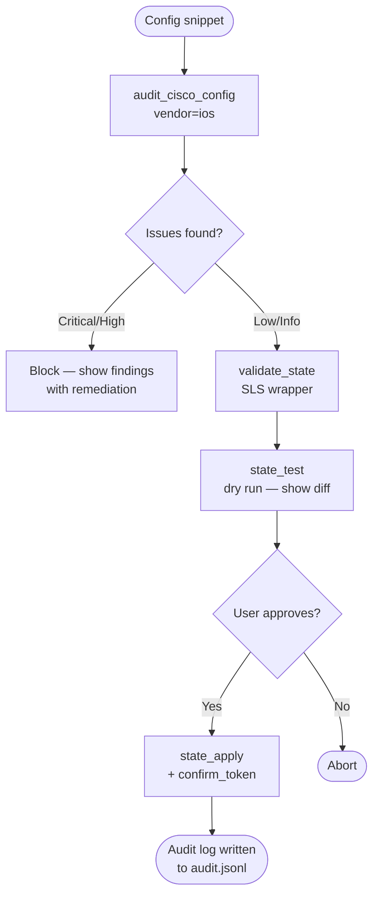
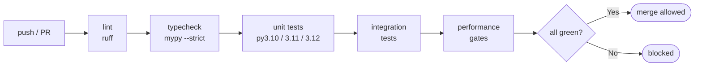

# salt-cisco-mcp

> **Stop your AI agent from hallucinating Salt functions.**  
> An offline-first [Model Context Protocol](https://modelcontextprotocol.io) server that grounds coding agents in the official Salt 3007 documentation — covering Cisco IOS, IOS-XR, NX-OS, and NAPALM proxy minions.

[](https://github.com/Muminur/salt-mcp-server/actions/workflows/ci.yml)
[](https://pypi.org/project/salt-cisco-mcp/)
[](https://pypi.org/project/salt-cisco-mcp/)
[](LICENSE)
[](#development)
[](#development)

---

## Contents

- [One-line install](#one-line-install)
- [How it works](#how-it-works)
- [Architecture](#architecture)
- [Quickstart](#quickstart)
- [Workflow examples](#workflow-examples)
  - [Configure NTP on a Cisco router](#workflow-1--configure-ntp-on-a-cisco-ios-router)
  - [Debug a failing state](#workflow-2--debug-a-failing-salt-state)
  - [Migrate legacy SLS](#workflow-3--migrate-legacy-sls-to-salt-3007)
  - [Audit before pushing config](#workflow-4--audit-cisco-config-before-applying)
- [Tool reference](#tool-reference)
- [Token efficiency](#token-efficiency)
- [Configuration](#configuration)
- [Vector search](#vector-search-optional)
- [Agent integrations](#agent-integrations)
- [Security](#security)
- [Development](#development)

---

## One-line install

```bash
curl -sSL https://raw.githubusercontent.com/Muminur/salt-mcp-server/main/install.sh | bash
```

The script checks for Python 3.10+, installs via `pipx`, runs initial setup, builds the offline doc index, and verifies the install. See [install.sh](install.sh) for exactly what it does.

**Manual install (step by step):**

```bash
pipx install salt-cisco-mcp          # install the package
sudo salt-cisco-mcp install          # create /etc/salt/mcp/ and starter config.yaml
salt-cisco-mcp scrape                # build offline doc index  (~5 min, ~50 MB)
salt-cisco-mcp verify                # confirm everything is ready
```

Full prerequisites and SELinux notes: [docs/install.md](docs/install.md)

---

## How it works

Without this server, agents must guess Salt function names from training data — which is stale the moment a new Salt release ships, and wrong for vendor-specific modules like `napalm`, `nxos`, and `cisconso`.

**With salt-cisco-mcp:**

1. The offline index contains every Salt 3007 module doc, pre-chunked and FTS5-indexed.
2. Your agent calls `search_docs("configure NTP ios")` before writing any SLS.
3. It gets back the exact function signature, argument names, and a citable anchor URL.
4. Every suggestion the agent makes links back to the official docs — auditable and reproducible.

```
Without MCP                          With salt-cisco-mcp
──────────────────────────────────   ──────────────────────────────────
Agent: "use napalm.set_ntp_servers"  Agent: search_docs("ntp ios napalm")
       ↑ hallucinated function name   → confirm_function_exists(...)
                                      → validate_state(sls)
                                      → state_test(target, sls)
                                      "use net.load_config with ntp template"
                                           ↑ grounded in real docs
```

---

## Architecture



**Request flow for a typical `search_docs` call:**



---

## Quickstart

### Option A — stdio transport (Claude Code / Codex CLI)

```bash
# Register with Claude Code
claude mcp add salt-cisco-mcp -- salt-cisco-mcp serve --transport stdio

# Or start manually and pipe your agent to it
salt-cisco-mcp serve --transport stdio
```

### Option B — HTTP transport (Copilot / Continue / Cursor)

```bash
# Generate a bearer token (keep this secret)
python3 -c "import secrets; print(secrets.token_hex(32))" > ~/.salt-mcp/token.txt

# Start the server
salt-cisco-mcp serve --transport http --host 127.0.0.1 --port 7842
```

Then point your agent at `http://127.0.0.1:7842` with the token as a Bearer auth header.

### Option C — Enable write tools (for state apply / push config)

```bash
# Generate a confirm token for each write session
salt-cisco-mcp serve --transport stdio --allow-write
```

Every write call (`state_apply`, `push_config`) requires passing the current `confirm_token` — this prevents accidental applies.

---

## Workflow examples

### Workflow 1 — Configure NTP on a Cisco IOS router

**Prompt to your agent:**
```
Configure NTP servers 1.1.1.1 and 8.8.8.8 on Cisco IOS router "edge-01"
using Salt 3007. Show me the SLS before applying anything.
```

**What the agent does under the hood:**



**The SLS the agent produces:**

```yaml
# ntp.sls — grounded in search_docs result, anchor_url cited
configure_ntp_edge01:
  net.load_template:
    - template_name: salt://templates/ntp.j2
    - template_vars:
        ntp_servers:
          - 1.1.1.1
          - 8.8.8.8
    - test: False
```

**Citation returned by search_docs:**

```json
{
  "module": "salt.modules.napalm_network",
  "function": "net.load_template",
  "anchor_url": "https://docs.saltproject.io/en/3007/ref/modules/all/salt.modules.napalm_network.html#salt.modules.napalm_network.load_template",
  "doc_hash": "a3f9..."
}
```

---

### Workflow 2 — Debug a failing Salt state

**Prompt:**
```
My state "configure_acl" is failing on nxos-spine-01 with:
"AttributeError: 'NoneType' object has no attribute 'get'"
Help me diagnose and fix it.
```

**Agent diagnostic flow:**



**Tools the agent calls, in order:**

| Step | Tool call | What it finds |
|---|---|---|
| 1 | `get_pillar("nxos-spine-01")` | proxy: pillar missing `driver` field |
| 2 | `search_docs("nxos proxy driver required fields")` | NX-OS proxy requires `driver: nxos_ssh` |
| 3 | `validate_state(sls)` | No SLS errors — confirms it's a pillar issue |
| 4 | `generate_pillar(proxytype="nxos", host="10.0.0.1")` | Returns correct pillar template |

**Root cause found:** pillar missing `driver: nxos_ssh` — the agent outputs the corrected pillar snippet with the upstream doc URL attached.

---

### Workflow 3 — Migrate legacy SLS to Salt 3007

**Prompt:**
```
Migrate this pre-Salt-3000 SLS file to Salt 3007 syntax.
Use the migrate_legacy_syntax prompt.
```

**What changes the agent makes:**



**Agent prompt to use:**

```
Use the migrate_legacy_syntax prompt with this SLS content:

install_ntp:
  cmd.run:
    - name: 'apt-get install -y ntp'
configure_ntp:
  file.managed:
    - name: /etc/ntp.conf
    - source: salt://ntp/ntp.conf
start_ntp:
  service.running:
    - name: ntp
    - enable: True
    - require:
      - pkg: install_ntp
```

The agent returns: migrated YAML + a table of every changed line + citation for each change.

---

### Workflow 4 — Audit Cisco config before applying

**Prompt:**
```
Before we push this IOS config to edge-01, run a security audit
and tell me if anything looks risky.
```

**Safety gate flow:**



**Example audit output:**

```
AUDIT FINDINGS — edge-01 IOS config
════════════════════════════════════
[HIGH]   Telnet enabled (line vty 0 4) — CIS IOS Benchmark §2.2
[HIGH]   SNMPv1 community string present — use SNMPv3 with authPriv
[INFO]   NTP authentication not configured — consider ntp authenticate
[PASS]   SSH v2 only — OK
[PASS]   AAA new-model configured — OK

2 high, 0 medium, 1 info — recommend resolving HIGH findings before applying.
```

---

## Tool reference

### Retrieval tools

| Tool | Signature | Returns |
|---|---|---|
| `search_docs` | `query, top_k=5, brief=False, token_budget=2000` | Ranked doc chunks with `module`, `function`, `anchor_url`, `doc_hash`, `text` |
| `get_doc` | `anchor_url` | Full doc chunk for one anchor |
| `list_modules` | `kind=None, limit=200` | Module names (execution/state/proxy/runner/grain) |
| `list_loaded_functions` | `prefix=None, limit=200` | Functions loaded on the master |
| `live_fetch` | `url` | Live page content (16 KB cap, ETag-cached) |

### Salt master tools

| Tool | Signature | Returns |
|---|---|---|
| `confirm_function_exists` | `name` | `{exists, variants}` — the anti-hallucination gate |
| `list_minions` | `filter=None` | Minion IDs + grain summary |
| `get_grains` | `minion_id=None, keys=None` | Grains dict (50-key cap) |
| `get_pillar` | `minion_id=None` | Redacted pillar (50 top-level-key cap) |

### Validation tools

| Tool | Signature | Returns |
|---|---|---|
| `validate_pillar` | `yaml_str` | `{valid, errors, doc_urls}` |
| `validate_state` | `sls` | `{valid, warnings, errors}` |
| `render_jinja` | `template, context` | Rendered output (sandboxed) |
| `audit_cisco_config` | `config, vendor` | Findings list with severity + CIS reference |
| `generate_pillar` | `proxytype, host, username, ...` | Known-good pillar template |

### Dry-run tools

| Tool | Signature | Returns |
|---|---|---|
| `state_show_sls` | `target, sls` | Compiled state object |
| `state_test` | `target, sls` | Predicted changes + success flag |

### Write tools *(require `--allow-write` + `confirm_token`)*

| Tool | Signature | Returns |
|---|---|---|
| `state_apply` | `target, sls, confirm_token` | Apply result + audit log reference |
| `push_config` | `target, config_text, mode, confirm_token` | Diff before/after + audit log reference |

---

## Token efficiency

Tool responses are designed to minimise LLM token consumption. All numbers measured with tiktoken `cl100k_base` on real Salt 3007 doc content.

### search_docs response size

| Mode | P50 | P95 | Best for |
|---|---|---|---|
| `search_docs(query)` | ~223 tokens | ~1 200 tokens | Deep reads — agent needs full text |
| `search_docs(query, brief=True)` | ~90 tokens | ~305 tokens | Scan-then-read — find the right anchor first |

**Scan-then-read pattern (saves ~60% tokens):**

```python
# Step 1 — scan for the right function (brief=True, low token cost)
results = search_docs("configure ospf ios", brief=True)
# → [{module, function, anchor_url, doc_hash}, ...]  — no body text

# Step 2 — fetch full text for only the best match
doc = get_doc(results[0]["anchor_url"])
# → {text, anchor_url, heading, kind, doc_hash}
```

### Response caps

| Tool | Cap | Behaviour when exceeded |
|---|---|---|
| `live_fetch` | 16 000 chars (~4K tokens) | Returns `truncated: true` |
| `get_grains` | 50 keys | Returns `total` + `truncated: true` |
| `get_pillar` | 50 top-level keys | Returns `total_keys` + `truncated: true` |
| `list_loaded_functions` | 200 (default), max 500 | Returns `total` + `truncated: true` |
| `list_modules` | 200 (default), max 1000 | Returns `total` + `truncated: true` |

---

## Configuration

Default config is written to `/etc/salt/mcp/config.yaml` by `salt-cisco-mcp install`.

```yaml
# /etc/salt/mcp/config.yaml

# Transport — stdio (default) or http
transport: stdio

# HTTP transport settings (only used when transport: http)
http:
  host: "127.0.0.1"
  port: 7842
  token_file: "/etc/salt/mcp/token"   # bearer token, one line

# Documentation index
paths:
  db: "/var/lib/salt-mcp/docs.db"
  live_cache: "/var/lib/salt-mcp/live-cache/"
  audit_log: "/var/log/salt-mcp/audit.jsonl"

# Retrieval behaviour
retrieval:
  default_response_tokens: 2000     # default budget for search_docs responses
  default_max_tokens: 1500          # chunk size during scrape / indexing
  search_top_k: 5                   # default top_k for search_docs
  live_fallback_enabled: true       # fetch from docs.saltproject.io on index miss

  # Optional hybrid search (requires: pip install salt-cisco-mcp[embeddings])
  embeddings:
    enabled: false
    model: "BAAI/bge-small-en-v1.5"

  # Optional reranker (requires embeddings: enabled: true)
  reranker:
    enabled: false
    model: "BAAI/bge-reranker-base"

# Write gate — disabled by default
allow_write: false

# Redact these keys from pillar responses (in addition to built-in set)
extra_redact_keys: []

# Telemetry
telemetry:
  metrics_dir: "/var/lib/salt-mcp/"
  log_file: ""   # empty = stderr only
```

Override any value with an environment variable:

```bash
SALT_MCP_TRANSPORT=http
SALT_MCP_HTTP__PORT=7843
SALT_MCP_RETRIEVAL__SEARCH_TOP_K=10
SALT_MCP_ALLOW_WRITE=true
```

---

## Vector search (optional)

By default `search_docs` uses BM25 full-text search (fast, no GPU, no model download).

Install the optional embedding backend for hybrid BM25 + vector search:

```bash
pip install "salt-cisco-mcp[embeddings]"
# Downloads BAAI/bge-small-en-v1.5 (~130 MB) on first use via fastembed ONNX
```

### Retrieval mode comparison

| Mode | Install | Quality | Cold-start | Token use |
|---|---|---|---|---|
| BM25 only (default) | base package | Good | < 1.5 s | Baseline |
| BM25 + vector (hybrid) | `[embeddings]` | Better | < 4 s | Baseline |
| Hybrid + reranker | `[embeddings]` + config | Best | < 6 s | Baseline |

Enable hybrid mode in `config.yaml`:

```yaml
retrieval:
  embeddings:
    enabled: true
  reranker:
    enabled: true
    model: "BAAI/bge-reranker-base"
```

Or pass `--no-embeddings` to force BM25-only regardless of config:

```bash
salt-cisco-mcp serve --no-embeddings
```

All three modes work on Windows, macOS, and Linux.

---

## Agent integrations

Per-agent setup guides with copy-paste config snippets:

| Agent | Transport | Guide |
|---|---|---|
| **Claude Code** | stdio | [docs/integrations/claude-code.md](docs/integrations/claude-code.md) |
| **Codex CLI** | stdio | [docs/integrations/codex.md](docs/integrations/codex.md) |
| **GitHub Copilot / VS Code** | HTTP | [docs/integrations/copilot.md](docs/integrations/copilot.md) |
| **Continue** | HTTP | [docs/integrations/continue.md](docs/integrations/continue.md) |
| **Cursor** | HTTP | [docs/integrations/cursor.md](docs/integrations/cursor.md) |

### Quick reference — Claude Code

```bash
# Register (one-time)
claude mcp add salt-cisco-mcp -- salt-cisco-mcp serve --transport stdio

# Verify it's listed
claude mcp list

# Remove
claude mcp remove salt-cisco-mcp
```

### Quick reference — HTTP clients

```bash
# Start server
salt-cisco-mcp serve --transport http --host 127.0.0.1 --port 7842

# Test with curl
TOKEN=$(cat ~/.salt-mcp/token.txt)
curl -s -X POST http://127.0.0.1:7842/mcp \
  -H "Authorization: Bearer $TOKEN" \
  -H "Content-Type: application/json" \
  -d '{"jsonrpc":"2.0","id":1,"method":"tools/list","params":{}}' | jq '.result.tools[].name'
```

---

## Security

| Property | Implementation |
|---|---|
| No command injection | All `subprocess` calls use list argv with `shell=False` |
| No timing oracle | Bearer token comparison uses `hmac.compare_digest` |
| Pillar always redacted | Passwords, secrets, community strings masked before returning to agents |
| Write gate | `state_apply` / `push_config` only registered with `--allow-write`; each call requires a `confirm_token` |
| Audit trail | Every write logged to `audit.jsonl` with hashed tokens — never raw credentials |
| Network allowlist | `live_fetch` only fetches from `docs.saltproject.io` by default |

Full threat model: [docs/security.md](docs/security.md)

### Audit log format

```jsonl
{"ts":"2026-05-13T14:23:01Z","tool":"state_apply","target":"nxos-spine-01","sls_hash":"sha256:abc...","token_hash":"sha256:def...","result":"ok","duration_ms":842,"client_session_id":"s-xyz"}
```

Rotate the log with `logrotate` — see [docs/runbook.md](docs/runbook.md).

---

## Observability

Metrics are written to `$telemetry.metrics_dir/metrics.prom` in Prometheus textfile format:

```
# Prometheus textfile — consumed by node_exporter --collector.textfile
salt_mcp_tool_calls_total{tool="search_docs"} 142
salt_mcp_tool_calls_total{tool="validate_state"} 38
salt_mcp_tool_latency_ms_sum{tool="search_docs"} 2840
salt_mcp_tool_latency_ms_count{tool="search_docs"} 142
salt_mcp_doc_chunks_total 5241
salt_mcp_live_fallback_calls_total 4
salt_mcp_validation_failures_total 2
```

Every tool call also emits a structured JSON log line via structlog:

```json
{"ts":"2026-05-13T14:23:01Z","level":"info","event":"tool_call","tool":"search_docs","duration_ms":18,"tokens_returned":211,"tokens_budget":2000,"source":"index","low_confidence":false}
```

---

## Development

```bash
git clone https://github.com/Muminur/salt-mcp-server.git
cd salt-mcp-server
pip install -e ".[dev]"

make test         # run all tests + coverage gate (89.8%, threshold 85%)
make lint         # ruff check (zero warnings policy)
make typecheck    # mypy --strict (zero errors policy)
make fmt          # ruff format
make scan         # pip-audit --strict — dependency CVE scan
make scrape       # build local doc index
make serve        # start server in stdio mode
```

### Test suite

```
706 tests passing  |  89.8% line coverage  |  Python 3.10 / 3.11 / 3.12
```

Tests are organised by layer:

```
tests/
├── docs/           # chunker, normaliser, retriever, golden queries
├── tools/          # every MCP tool (unit, with fake salt-call fixture)
├── prompts/        # MCP prompt templates
├── salt_master/    # adapter, redactor, pillar reader
├── validate/       # pillar schema, state lint, jinja preview
├── performance/    # P50/P95 benchmarks, cold-start, RSS
├── e2e/            # full stdio round-trip tests
└── hallucination/  # 100-prompt corpus; CI gate: <5% unresolved functions
```

### CI pipeline



---

## License

Apache-2.0 — see [LICENSE](LICENSE)
